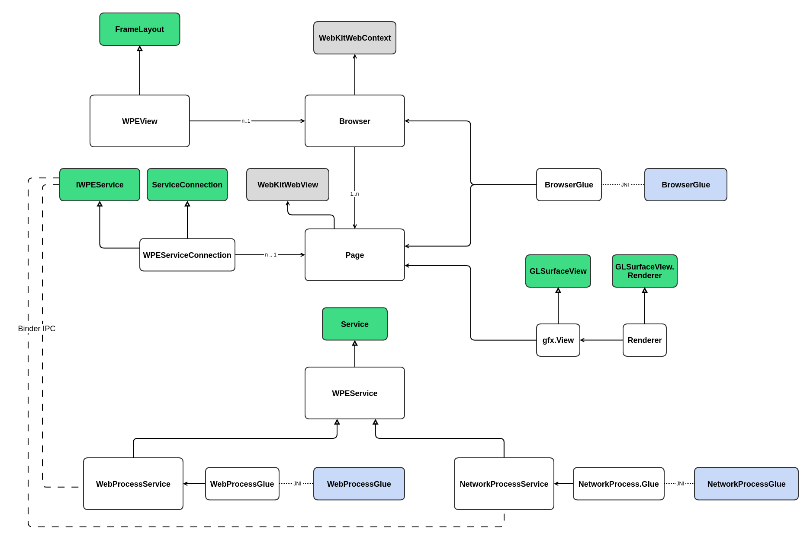

# Architecture

## Building blocks



### WPEView
WPEView wraps WPE WebKit browser engine in a reusable Android library.
WPEView serves a similar purpose to Android's built-in WebView and tries to mimick its API aiming
to be an easy to use drop-in replacement with extended functionality.

WPEView is the entry point for WPE Android users. It exposes methods to load urls, navigate back
and forward, reload, etc.

WPEView inherits from [android.widget.FrameLayout](https://developer.android.com/reference/kotlin/android/widget/FrameLayout)
and it is meant to be added to Activity layouts this way:

```xml
<com.wpe.wpeview.WPEView
        android:id="@+id/wpe_view"
        android:layout_width="match_parent"
        android:layout_height="match_parent"
        tools:context=".MainActivity"/>
```

Every instance of WPEView is registered with the main `Browser` and it has a single `Page` associated.

### Browser
Top level Singleton object. Among other duties it:

- manages the creation and destruction of `Page` instances.
- funnels `WPEView` API calls to the appropriate `Page` instance.
- manages the Android Services equivalent to WebKit's auxiliary processes (Web and Network processes).
- hosts the UIProcess thread where the WebKitWebContext instance lives and the main loop is run.

### Page
A Page roughly corresponds to a tab in a regular browser UI.
There is a 1:1 relationship between WPEView and Page.
Each Page instance has its own `wpe.wpe.gfx.View` and `WebKitWebView` instances associated.
It also keeps references to the Services that host the logic of WebKit's auxiliary
processes (Web and Network processes).

### gfx.View
[android.opengl.GLSurfaceView](https://developer.android.com/reference/android/opengl/GLSurfaceView?hl=en)
extension in charge of managing the Surface that is handled over to WebKit to do the actual rendering.

## WPE

TODO

## Boot up process

Everything starts with the instanciation and inflation of a new [WPEView](https://gitlab.igalia.com/teams/webkit/wpe-android/-/blob/948e2ed2f1f79cf51256a44ed93b80a10c466a2f/wpe/src/main/java/com/wpe/wpeview/WPEView.java#L25). 
After construction its [onFinishInflate](https://gitlab.igalia.com/teams/webkit/wpe-android/-/blob/948e2ed2f1f79cf51256a44ed93b80a10c466a2f/wpe/src/main/java/com/wpe/wpeview/WPEView.java#L40) 
method is called. This queues a task to create a new [Page](https://gitlab.igalia.com/teams/webkit/wpe-android/-/blob/948e2ed2f1f79cf51256a44ed93b80a10c466a2f/wpe/src/main/java/com/wpe/wpeview/WPEView.java#L40) 
instance through the [Browser](https://gitlab.igalia.com/teams/webkit/wpe-android/-/blob/948e2ed2f1f79cf51256a44ed93b80a10c466a2f/wpe/src/main/java/com/wpe/wpeview/WPEView.java#L40) 
singleton instance. If this is the first time the Browser instance is obtained, [Browser construction](https://gitlab.igalia.com/teams/webkit/wpe-android/-/blob/948e2ed2f1f79cf51256a44ed93b80a10c466a2f/wpe/src/main/java/com/wpe/wpe/Browser.java#L219) 
happens, creating an instance of [BrowserGlue](https://gitlab.igalia.com/teams/webkit/wpe-android/-/blob/948e2ed2f1f79cf51256a44ed93b80a10c466a2f/wpe/src/main/java/com/wpe/wpe/Browser.java#L219) 
and spawning [UIProcessThread](https://gitlab.igalia.com/teams/webkit/wpe-android/-/blob/948e2ed2f1f79cf51256a44ed93b80a10c466a2f/wpe/src/main/java/com/wpe/wpe/Browser.java#L219). 
This is the thread where the actual WebKit's UIProcess logic runs. On execution it creates an instance of [WebKitWebContext](https://gitlab.igalia.com/teams/webkit/wpe-android/-/blob/948e2ed2f1f79cf51256a44ed93b80a10c466a2f/wpe/src/main/glue/browser/browser.cpp#L36) 
and [runs the main loop](https://gitlab.igalia.com/teams/webkit/wpe-android/-/blob/948e2ed2f1f79cf51256a44ed93b80a10c466a2f/wpe/src/main/glue/browser/browser.cpp#L40).

On [Page construction](https://gitlab.igalia.com/teams/webkit/wpe-android/-/blob/948e2ed2f1f79cf51256a44ed93b80a10c466a2f/wpe/src/main/java/com/wpe/wpe/Page.java#L121) 
an instance of [WebKitWebView](https://gitlab.igalia.com/teams/webkit/wpe-android/-/blob/948e2ed2f1f79cf51256a44ed93b80a10c466a2f/wpe/src/main/java/com/wpe/wpe/Page.java#L173) 
is created through [BrowserGlue](https://gitlab.igalia.com/teams/webkit/wpe-android/-/blob/948e2ed2f1f79cf51256a44ed93b80a10c466a2f/wpe/src/main/glue/browser/browser.cpp#L78). 
The `Page` instance [gets and keeps a reference](https://gitlab.igalia.com/teams/webkit/wpe-android/-/blob/948e2ed2f1f79cf51256a44ed93b80a10c466a2f/wpe/src/main/java/com/wpe/wpe/Page.java#L160) 
of the just created WebKitWebView. If no URL load has been requested, the process stops there.

When a new URL load is requested through the [WPEView.loadUrl](https://gitlab.igalia.com/teams/webkit/wpe-android/-/blob/948e2ed2f1f79cf51256a44ed93b80a10c466a2f/wpe/src/main/java/com/wpe/wpeview/WPEView.java#L70) 
method, we ensure that there's a valid `WebKitWebView` reference. Otherwise we queue the load until we get that reference from the process described before.

Once we have a URL to load and a valid `WebKitWebView` reference, we [request](https://gitlab.igalia.com/teams/webkit/wpe-android/-/blob/948e2ed2f1f79cf51256a44ed93b80a10c466a2f/wpe/src/main/java/com/wpe/wpe/Page.java#L250) 
the URL load [through BrowserGlue](https://gitlab.igalia.com/teams/webkit/wpe-android/-/blob/948e2ed2f1f79cf51256a44ed93b80a10c466a2f/wpe/src/main/glue/browser/browser.cpp#L146).

Loading an URL triggers the creation of the Web and Network processes. WebKit requests the creation of its auxiliary processes through the 
[BrowserGlue.launchProcess](https://gitlab.igalia.com/teams/webkit/wpe-android/-/blob/948e2ed2f1f79cf51256a44ed93b80a10c466a2f/wpe/src/main/java/com/wpe/wpe/BrowserGlue.java#L49) 
method.

The auxiliary process creation request is [handled by the Browser](https://gitlab.igalia.com/teams/webkit/wpe-android/-/blob/948e2ed2f1f79cf51256a44ed93b80a10c466a2f/wpe/src/main/java/com/wpe/wpe/Browser.java#L273) 
which picks the active Page instance to assign the process identifier given by WebKit and to request the actual process launch.

The auxiliary processes are actually [Android Services](https://developer.android.com/guide/components/services)

Browser [keeps a registry](https://gitlab.igalia.com/teams/webkit/wpe-android/-/blob/948e2ed2f1f79cf51256a44ed93b80a10c466a2f/wpe/src/main/java/com/wpe/wpe/Browser.java#L106) 
with a match between process identifier, Page and ServiceConnection.

The active `Page` instance is the final responsible of [spawning](https://gitlab.igalia.com/teams/webkit/wpe-android/-/blob/948e2ed2f1f79cf51256a44ed93b80a10c466a2f/wpe/src/main/java/com/wpe/wpe/Page.java#L190) 
the auxiliary process / Android Service.

When launching the Web Process, a new [gfx.View](https://gitlab.igalia.com/teams/webkit/wpe-android/-/blob/948e2ed2f1f79cf51256a44ed93b80a10c466a2f/wpe/src/main/java/com/wpe/wpe/gfx/View.java) 
is [created](https://gitlab.igalia.com/teams/webkit/wpe-android/-/blob/948e2ed2f1f79cf51256a44ed93b80a10c466a2f/wpe/src/main/java/com/wpe/wpe/Page.java#L208), 
unless an existing instance exists, and a [new thread is spawned](https://gitlab.igalia.com/teams/webkit/wpe-android/-/blob/948e2ed2f1f79cf51256a44ed93b80a10c466a2f/wpe/src/main/java/com/wpe/wpe/Page.java#L180) 
to ensure that a valid Surface texture is available. When the `gfx.View` instance is created, the owning WPEView instance [is notified](https://gitlab.igalia.com/teams/webkit/wpe-android/-/blob/e1727079e4ea940a5c542d23b7adbff3a7eb413e/wpe/src/main/java/com/wpe/wpeview/WPEView.java#L74) 
so it can display the View.
