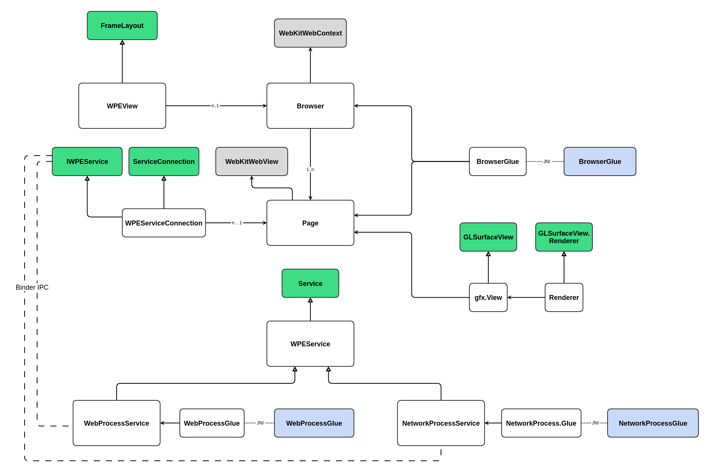

# Android API Architecture

This document describes the current Android API split after the WPEPlatform
backend, JNI/CAPI bridge, and high-level convenience API changes.

Older documentation and examples may still refer to `WPEView`, `WPEContext`,
`WKWebView`, `WKWebContext`, or Browser/Page/gfx.View internals. Those names
belong to the pre-refactor API path and are kept in the source tree for
compatibility while the new API is adopted. New code should use the APIs
described below.



## Layers

### Layer 0: Runtime and process infrastructure

This layer initializes native libraries, configures the WebKit process provider,
starts the native looper, bridges Android and GLib event delivery, and manages
the Android services used for auxiliary processes.

Java code lives in:

- `wpeview/src/main/java/org/wpewebkit/WPEApplication.java`
- `wpeview/src/main/java/org/wpewebkit/wpe/WKRuntime.java`
- `wpeview/src/main/java/org/wpewebkit/wpe/WKActivityObserver.java`
- `wpeview/src/main/java/org/wpewebkit/wpe/AuxiliaryProcessesContainer.java`
- `wpeview/src/main/java/org/wpewebkit/wpe/WKCallback.java`
- `wpeview/src/main/java/org/wpewebkit/wpe/services/`

Native code lives in:

- `wpeview/src/main/cpp/Runtime/EntryPoint.cpp`
- `wpeview/src/main/cpp/Runtime/WKRuntime.cpp`
- `wpeview/src/main/cpp/Runtime/MessagePump.cpp`
- `wpeview/src/main/cpp/Runtime/LooperThread.cpp`
- `wpeview/src/main/cpp/Runtime/WKCallback.cpp`
- `wpeview/src/main/cpp/Common/`

`Runtime/EntryPoint.cpp` is the JNI entry point. It initializes the common JNI
environment, registers the legacy `WK*` JNI mappings, then registers the new
`capi/` mappings through `WebKit::configureJNIMappings()`.

### Layer 1: Public Android convenience API

This is the Android widget API intended for application developers. It owns the
Android UI behavior: `SurfaceView` lifecycle, physical-to-logical coordinate
translation, adaptation of touch and key events, and delivery to WebView-style
clients.

Java code lives in:

- `wpeview/src/main/java/org/wpewebkit/wpeview/WebView.java`
- `wpeview/src/main/java/org/wpewebkit/wpeview/WebContext.java`
- `wpeview/src/main/java/org/wpewebkit/wpeview/WebSettings.java`
- `wpeview/src/main/java/org/wpewebkit/wpeview/CookieManager.java`
- `wpeview/src/main/java/org/wpewebkit/wpeview/WebViewClient.java`
- `wpeview/src/main/java/org/wpewebkit/wpeview/WebChromeClient.java`

Use this layer when embedding WPE in a normal Android view hierarchy:

```xml
<org.wpewebkit.wpeview.WebView
    android:id="@+id/web_view"
    android:layout_width="match_parent"
    android:layout_height="match_parent" />
```

```java
WebView webView = findViewById(R.id.web_view);
webView.setWebViewClient(new WebViewClient());
webView.setWebChromeClient(new WebChromeClient());
webView.loadUrl("https://www.wpewebkit.org/");
```

`WebView` creates a `WebContext` by default. Applications that want to share
engine state, settings, cookie policy, cache directories, or automation mode
between multiple views should create one `WebContext` and pass it to each
`WebView`.

```java
WebContext context = new WebContext(applicationContext);
WebView first = new WebView(context);
WebView second = new WebView(context);
```

### Layer 2: Low-level Java JNI/CAPI bridge

This layer exposes Java proxy objects for WebKit and WPEPlatform native objects.
It is intended for advanced embedders who want to manage the WPE objects
directly instead of using the Android `WebView` convenience widget.

Java code lives in `wpeview/src/main/java/org/wpewebkit/wpe/`:

- `WebKitWebView` wraps a native `WebKitWebView`.
- `WebKitWebContext` wraps a native `WebKitWebContext`.
- `WebKitNetworkSession` wraps a native `WebKitNetworkSession`.
- `WebKitWebsiteDataManager` wraps a native `WebKitWebsiteDataManager`.
- `WebKitCookieManager` wraps a native `WebKitCookieManager`.
- `WebKitSettings` wraps a native `WebKitSettings`.
- `WPEDisplay` wraps a native `WPEDisplay`.
- `WPEScreen` wraps a native `WPEScreen`.
- `WPEToplevel` wraps a native `WPEToplevel`.
- `WPEView` wraps a native `WPEView`.
- `MainLooperDispatcher` adapts callbacks to the Android main looper.

Native bridge code lives in `wpeview/src/main/cpp/capi/`. File names mirror the
Java proxy names and the native types they expose:

- `WebKitWebView.cpp`
- `WebKitWebContext.cpp`
- `WebKitNetworkSession.cpp`
- `WebKitWebsiteDataManager.cpp`
- `WebKitCookieManager.cpp`
- `WebKitSettings.cpp`
- `WPEDisplay.cpp`
- `WPEScreen.cpp`
- `WPEToplevel.cpp`
- `WPEView.cpp`
- `JNIMappings.cpp`

This layer is deliberately small, but it is not a raw pointer dump. It is
responsible for JNI marshalling, native reference ownership, signal hookup,
callback lifetime, and Java-side thread adaptation. Android widget policy still
belongs in Layer 1.

Callbacks exposed from this layer are delivered to Java on the Android main
looper. For asynchronous JavaScript evaluation, `WebKitWebView` posts the result
through `MainLooperDispatcher`. For automation view creation,
`WebKitWebContext` may synchronously post to the main looper and block until the
UI-bound Java object has been created.

### Layer 3: Android WPEPlatform implementation

This layer implements the WPEPlatform backend for Android. It is the native
Android platform logic used by WebKit through the WPEPlatform abstraction.

Native code lives in `wpeview/src/main/cpp/Platform/`:

- `WPEDisplayAndroid.cpp`
- `WPEToplevelAndroid.cpp`
- `WPEViewAndroid.cpp`
- `WPEInputMethodContextAndroid.cpp`
- `WPEKeymapAndroid.cpp`
- `WPEScreenAndroid.cpp`
- `WPEScreenSyncObserverAndroid.cpp`

This is where Android-specific rendering and platform integration belongs:
`EGL`, `ASurfaceControl`, `ASurfaceTransaction`, Android native windows,
buffer presentation, screen state, key mapping, and IME integration.

Platform classes use the `Android` suffix because they are concrete
implementations of WPEPlatform types. For example, `WPEDisplayAndroid`
implements the WPE display vfuncs and registers the `"android"` display
extension; `WPEViewAndroid` owns rendering/buffer integration for a `WPEView`;
`WPEToplevelAndroid` owns the Android native-window connection for a
`WPEToplevel`.

### Layer 4: WebKit/WPE engine

This project links against imported WebKit and WPE headers and libraries. The
engine is not Android UI code. It talks to the Android port through the
WPEPlatform implementation from Layer 3 and through the WebKit C API wrapped by
Layer 2.

Relevant imported native API locations include:

- `wpeview/src/main/cpp/imported/include/wpe-webkit/wpe/`
- `wpeview/src/main/cpp/imported/include/wpe-webkit/wpe-platform/`
- `wpeview/src/main/cpp/imported/lib/<abi>/libWPEWebKit-2.0.so`
- `wpeview/src/main/cpp/imported/lib/<abi>/libWPEBackend-android.so`

## Ownership and Lifetime

The Java proxies use explicit `destroy()` methods. Call them from the owner that
created the object, normally from the Android component lifecycle. Do not rely on
finalizers for the new API path.

Owning proxies:

| Java class | Native ownership |
| --- | --- |
| `WPEDisplay` | Owns a `WPEDisplay`; `destroy()` unreferences it and invalidates its borrowed `WPEScreen`. |
| `WPEToplevel` | Owns a `WPEToplevel`; `destroy()` unreferences it. |
| `WebKitWebContext` | Owns a bridge object holding a `WebKitWebContext`; `destroy()` disconnects automation signals and unreferences it. |
| `WebKitNetworkSession` | Owns a `WebKitNetworkSession`; `destroy()` unreferences it and invalidates the borrowed website data manager wrapper. |
| `WebKitSettings` | Owns a `WebKitSettings`; `destroy()` unreferences it. |
| `WebKitCookieManager` | Owns or holds the cookie manager wrapper for a network session; destroy it before destroying the session. |
| `WebKitWebView` | Owns a bridge object holding a `WebKitWebView`; `destroy()` disconnects signals, unreferences the native view, and invalidates its borrowed `WPEView`. |

Borrowed proxies:

| Java class | Native owner |
| --- | --- |
| `WPEView` | Borrowed from `WebKitWebView`. It must not outlive the parent `WebKitWebView`. |
| `WPEScreen` | Borrowed from `WPEDisplay`. It must not outlive the parent `WPEDisplay`. |
| `WebKitWebsiteDataManager` | Borrowed from `WebKitNetworkSession`. It must not outlive the parent `WebKitNetworkSession`. |

The high-level `WebView` owns the objects it creates in this order:

1. `WebContext`, unless the caller provided a shared context.
2. `WebKitWebView`.
3. Borrowed `WPEView` from `WebKitWebView`.
4. `WPEToplevel`.
5. `SurfaceView` and Android surface callbacks.

`WebView.destroy()` detaches the `WPEView` from the toplevel, destroys the
`WPEToplevel`, destroys the `WebKitWebView`, and finally destroys the owned
`WebContext` if the `WebView` created it. When a `WebContext` is shared, the
application owns it and must destroy it after all `WebView` instances using it
have been destroyed.

`WebContext.destroy()` destroys settings, cookie manager, network session, web
context, and display. This order matters because several wrappers borrow objects
from earlier owners.

Surface lifetime is separate from object lifetime. `WebView` may create a
`WPEToplevel` before an Android `Surface` exists, then attach the native window
from `surfaceCreated()` or `surfaceChanged()`. `surfaceDestroyed()` clears the
native window and unmaps the `WPEView`, but it does not destroy the WebKit page.

## Where to Add Code

Add Android application-facing APIs to Layer 1:

- Put new `android.webkit.WebView`-style methods on `wpeview/.../wpeview/WebView.java`.
- Put shared state and defaults on `WebContext.java`.
- Put app-visible settings on `WebSettings.java`, backed by `WebKitSettings`.
- Put app-visible callbacks on `WebViewClient.java` or `WebChromeClient.java`.
- Keep Android `View`, `SurfaceView`, gesture, focus, and key event policy in
  this layer.

Add low-level WebKit or WPE object coverage to Layer 2:

- Add or extend Java proxy classes in `org.wpewebkit.wpe`.
- Add matching JNI glue in `wpeview/src/main/cpp/capi/`.
- Register the mapping from `capi/JNIMappings.cpp`.
- Keep the Java class name aligned with the C type: `WebKit*` for WebKit C API
  objects and `WPE*` for WPEPlatform objects.
- Limit this layer to marshalling, ownership, signal hookup, and callback thread
  adaptation.

Add Android platform behavior to Layer 3:

- Add rendering, buffer, native-window, EGL, input method, screen, or keymap
  behavior under `wpeview/src/main/cpp/Platform/`.
- Use the `Android` suffix for concrete WPEPlatform implementations.
- Wire new platform source files into `wpeview/src/main/cpp/CMakeLists.txt`.

Add runtime or process behavior to Layer 0:

- Put JNI startup and mapping registration in `Runtime/EntryPoint.cpp`.
- Put process-provider changes in `Runtime/WKRuntime.cpp`.
- Put looper and GLib main-loop integration in `Runtime/MessagePump.cpp` or
  `Runtime/LooperThread.cpp`.
- Put service-side code under `org.wpewebkit.wpe.services` and
  `wpeview/src/main/cpp/Service/`.

## Naming

The current naming convention is:

| Responsibility | Java/API name | Native/API name |
| --- | --- | --- |
| Public Android widget | `org.wpewebkit.wpeview.WebView` | Uses the low-level proxies internally |
| Shared public Android state | `org.wpewebkit.wpeview.WebContext` | Owns display, WebKit context, session, cookies, and settings |
| Public Android settings | `org.wpewebkit.wpeview.WebSettings` | Backed by `WebKitSettings` |
| Public Android cookies | `org.wpewebkit.wpeview.CookieManager` | Backed by `WebKitCookieManager` and `WebKitWebsiteDataManager` |
| WebKit page proxy | `org.wpewebkit.wpe.WebKitWebView` | `WebKitWebView*` |
| WebKit context proxy | `org.wpewebkit.wpe.WebKitWebContext` | `WebKitWebContext*` |
| WebKit session proxy | `org.wpewebkit.wpe.WebKitNetworkSession` | `WebKitNetworkSession*` |
| WebKit settings proxy | `org.wpewebkit.wpe.WebKitSettings` | `WebKitSettings*` |
| WPE display proxy | `org.wpewebkit.wpe.WPEDisplay` | `WPEDisplay*` |
| WPE toplevel proxy | `org.wpewebkit.wpe.WPEToplevel` | `WPEToplevel*` |
| WPE view proxy | `org.wpewebkit.wpe.WPEView` | `WPEView*` |
| Android platform display | no Java class | `WPEDisplayAndroid` |
| Android platform toplevel | no Java class | `WPEToplevelAndroid` |
| Android platform view | no Java class | `WPEViewAndroid` |

Avoid adding new APIs with the generic `WK` prefix. Use `WebKit` when mirroring a
WebKit C API type, `WPE` when mirroring a WPEPlatform type, and the Android
framework-style names in `org.wpewebkit.wpeview` for the convenience API.

## Compatibility Notes

The following classes are legacy compatibility APIs and should not be the target
for new documentation or new app-facing features unless the feature must support
the old API path:

- `org.wpewebkit.wpeview.WPEView`
- `org.wpewebkit.wpeview.WPEContext`
- `org.wpewebkit.wpeview.WPESettings`
- `org.wpewebkit.wpeview.WPECookieManager`
- `org.wpewebkit.wpeview.WPEViewClient`
- `org.wpewebkit.wpeview.WPEChromeClient`
- `org.wpewebkit.wpe.WKWebView`
- `org.wpewebkit.wpe.WKWebContext`
- `org.wpewebkit.wpe.WKNetworkSession`
- `org.wpewebkit.wpe.WKSettings`
- `org.wpewebkit.wpe.WKCookieManager`
- `org.wpewebkit.wpe.WKWebsiteDataManager`

Runtime names such as `WKRuntime`, `WKCallback`, `WKActivityObserver`, and
`WKProcessType` are still part of the infrastructure layer and are not replaced
by the public API naming split yet.
